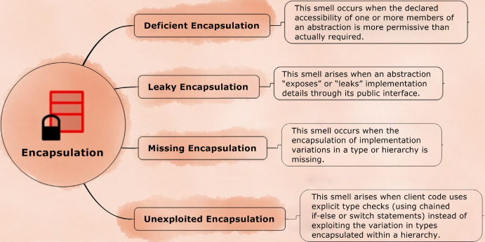
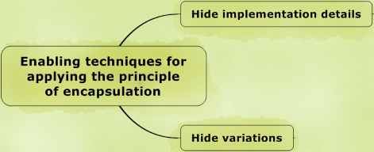
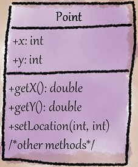
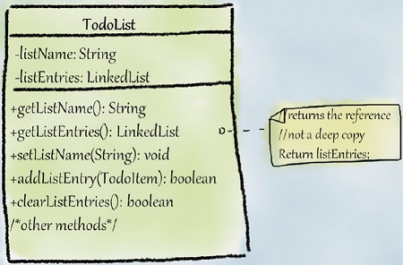
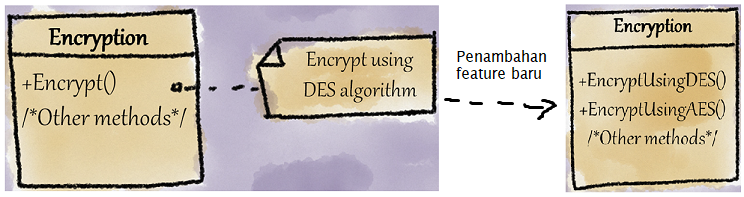

# Encapsulation

[Smell](.) → [Girish Suryanarayana et al. Code Smells](Girish) → [Encapsulation](#)



Semua smell di dalam grup ini berkaitan dengan kesalahan dalam merancang enkapsulasi dalam interface/abstraksi.

- [Deficient Encapsulation](#deficient-encapsulation)
- [Leaky Encapsulation](#leaky-encapsulation)
- [Missing Encapsulation](#missing-encapsulation)
- [Unexploited Encapsulation](#unexploited-encapsulation)

### Filosofi

Sebuah mobil mempunyai setir, pedal gas, dan pedal rem. Pedal rem berfungsi untuk melakukan pengereman mobil. Pengereman mobil sendiri mempunyai beberapa jenis, salah satunya adalah pengereman Anti-locking Braking System (ABS). Terkait terhadap kasus tersebut kita sebagai driver tentunya tidak perlu mengetahui detail mengenai sistem pengereman, karena kita cukup mengetahui pengereman tersebut melalui pedal rem kita sehingga detail sistem pengereman seperti ABS tidak diketahui secara langsung oleh kita.

### Prinsip Encapsulation

[Link Video](https://www.youtube.com/watch?v=WqXM5lHEwGY&list=PLG_Cu5FmqSk2KHT6lXngRvcOmOzuk4_ju&index=1)



Menurut Girish Suryanarayana dkk, terdapat 2 prinsip encapsulation yaitu:

- **Hide implementation details** - Class tidak perlu mengetahui detail implementasi member dan algoritma yang dimiliki oleh abstraksi.
- **Hide variations** - Class tidak perlu mengetahui variasi-variasi yang dimiliki pada hierarki sehingga ia cukup mengetahui implementasi abstraknya saja.

Berdasarkan pada pengamatan abstraction smell, terdapat pelanggaran prinsip encapsulation antara lain:

| Encapsulation smell | Pelanggaran prinsip encapsulation | Penyebab | Martin Fowler smells |
| --- | --- | --- | --- |
| Deficient Encapsulation | Hide implementation details | Adanya akses terhadap member abstraksi, terutama jika access modifier `public` | Inappropriate Intimacy |
| Leaky Encapsulation | Hide implementation details | - List: Data diperoleh dengan *swallow copy* bukan *deep copy*<br>- Penamaan method yang mengandung detail implementasi | Inappropriate Intimacy |
| Missing Encapsulation | Hide variations | a. Tidak ada pembagian Class<br>b. Hierarki bucin alias ada hierarki kembar | Divergent Changes, Parallel Inheritence |
| Unexploited Encapsulation | Hide variations | Penggunaan `if-else` atau `switch` statement dalam object type checking | Switch Statements |


## Deficient Encapsulation

[Link Video](https://www.youtube.com/watch?v=r-wphP9hQ8E&list=PLG_Cu5FmqSk2KHT6lXngRvcOmOzuk4_ju&index=2) |
[Materi](https://github.com/akmalrusli363/smell/tree/master/src/girish/encapsulation/deficient)

> PT Abun memiliki akun GitAsik untuk menampung project-project dari perusahaannya secara **private, public, dan semi-public**. Namun pada suatu hari, GitAsik menerima kasus bahwa repository semi-open milik PT Abun ternyata dapat diakses oleh **karyawan kompetitor PT Abun** itu sendiri padahal repository semi-public **hanya boleh diakses oleh perusahaan partner PT Abun**. Ternyata sialnya, karyawan GitAsik lupa mengubah access modifier sehingga menyebabkan kebocoran akses oleh kompetitor bahkan orang-orang awam sekalipun. Sungguh sangat kurang teliti karyawan GitAsik ini :anguished:

Di bahasa pemrograman Java, terdapat 4 level access modifier yang tentunya berperan sangat penting dalam membatasi akses data yaitu:

- **`private`** untuk akses dalam class saja, biasanya untuk perihal detail dan implementasi class/method.
- **`(package)`** untuk akses dari package yang sama, biasanya untuk perihal implementasi dalam satuan package.
- **`protected`** untuk akses dari package yang sama dan subclass yang di-*extend*, biasanya untuk perihal yang terpakai dalam subclass.
- **`public`** untuk akses dari mana saja, biasanya untuk perihal yang dipakai/diakses secara luas.

Penggunaan access modifier yang tidak sesuai pada konteks dapat menimbulkan smell yang fatal jika sampai terakses ataupun termodifikasi detail membernya. Smell ini terjadi ketika:

- Ada member yang memiliki access modifier yang permissive, terutama jika member tersebut dapat diakses oleh abstraksi mana saja (mirip [Inappropriate Intimacy](Couplers#inappropriate-intimacy)).
- Member class / abstraksi / hierarki dapat mengakses field tanpa setter getter.

Jika dibiarkan dapat berpotensi adanya pembocoran data yang tidak terduga.

### Penyebab Smell

- **Easier testability**: Dimana developer ingin menguji private method dengan mengubah access modifier `private` ke `public` yang seharusnya tidak diperbolehkan dalam testing, sehingga dapat terekspos oleh class lain.
- **Procedural thinking in object oriented context**: Adanya perbedaan paham dari Procedural Programmer terhadap global variabel dimana data member diekspos untuk keperluan akses oleh multiple abstractions.
- **Quick-fix solutions**: Developer menggunakan jalan pintas agar permasalahan dapat diselesaikan secepat mungkin seiring dengan deadline project dengan mengekspos member secara global padahal hanya untuk beberapa abstraksi saja.

### Contoh A: `java.awt.Point` dan `java.swing.text.SizeRequirements`

#### Masalah



Dalam kasus `java.awt.Point`, terdapat 2 member variabel yang menggunakan access modifier public (yaitu `x` dan `y`) padahal sudah disertakan setter getter. Meski demikian, kasus tersebut tidak bisa direfactor paksa karena kasus tersebut tentunya berpengaruh besar terhadap developer-developer Java.

```java
/** The alignment, specified as a value between 0.0 and 1.0,
inclusive. To specify centering, the alignment should be 0.5. */
public float alignment;
```

Selain kasus `java.awt.Point`, terdapat juga class [SizeRequirements](https://github.com/akmalrusli363/smell/tree/master/src/girish/encapsulation/deficient/before/SizeRequirement.java) dari package `java.swing.text` dimana pada variabel `alignment` dapat diakses dan diset nilainya langsung kepada variabel tersebut tanpa harus melalui validasi. Hal ini tentunya menimbulkan dampak fatal jika ada developer dengan \*sengaja\* menginput nilai sembarang.

#### Penyelesaian

Pada kasus yang riil, inputan lebih dari 1.0 dianggap variabel yang illegal sehingga perlu direfactor dengan mengubah access modifier `alignment` menjadi private, dan menambahkan method setter *(accessor)* dengan validasi dan getter *(mutator)*.

```java
/** The alignment, specified as a value between 0.0 and 1.0,
inclusive. To specify centering, the alignment should be 0.5. */
private float alignment;

public void setAlignment(float alignment) {
  if(alignment < 0 || alignment > 1) {
    throw new IllegalArgumentException("alignment must be between 0.0 and 1.0");
  }
  this.alignment = alignment;
}

public float getAlignment() {
  return alignment;
}
```

Hasilnya dalam package [after](https://github.com/akmalrusli363/smell/tree/master/src/girish/encapsulation/deficient/before/SizeRequirement.java) ketika user ingin melakukan input angka float alignment, user hanya bisa menginput alignment dari 0 hingga 1 sehingga menghindari adanya variable value mismatches dari variabel `alignment`.

### Contoh B: Testing private methods

#### Masalah

```java
public class Foo {
  // aslinya private method, diubah jadi public untuk testing
  private int bar() {
    return 2;
  }
}

class FooTest {
  @Test
  void test() {
    Foo f = new Foo();
    assertEquals(2, f.bar());
  }
}
```

Dalam kasus B, disebutkan bahwa developer ingin menguji private method dengan mengubah access modifier `private` ke `public`. Hal ini memang ada maksud baik untuk mempermudah testing, padahal hal seperti itu dilarang keras dalam praktek Testing karena dapat membocorkan akses member ke abstraction lain. Fatalnya, abstraction lain dapat mempermainkan private method sesuka hati tanpa harus melakukan *message chaining* antar method abstraction dan berdampak fatal secara sistematis.

#### Penyelesaian

Salah satu jalan pintas untuk testing private method adalah dengan menggunakan teknik **_Reflector_** dalam package `java.lang.reflect` dimana method diubah accessnya untuk keperluan testing pada contoh [test class](https://github.com/akmalrusli363/smell/tree/master/src/girish/encapsulation/deficient/testing_using_reflection/FooTest.java) atau secara syntaxnya:
```java
try {
  Method bar = f.getClass().getDeclaredMethod("bar", null);
  bar.setAccessible(true);
  Object result = bar.invoke(f, null);
  assertEquals(2, result);
} catch(Exception e) {
  fail(e);
}
```

Solusi tersebut merupakan salah satu cara agar private class tersebut dapat di-test dalam bahasa pemrograman Java.

### When to Ignore

- Jika global member tersebut dibuat dalam nested class atau anonymous class dimana member tersebut diakses kepada class tuan-nya.
- Class tersebut dipakai untuk meningkatkan performa dan efisiensi dengan mengakses field langsung daripada melalui setter getter.

### Julukan / Nama lain

- **Hideable public attributes/methods**: Method/attribut global dapat disembunyikan
- **Unencapsulated class**: Class dibiarkan terekspos
- **Class with unparameterized methods**: Method tanpa parameter


## Leaky Encapsulation

[Link Video](https://www.youtube.com/watch?v=FXLKSYTwk_0&list=PLG_Cu5FmqSk2KHT6lXngRvcOmOzuk4_ju&index=3) |
[Materi](https://github.com/akmalrusli363/smell/tree/master/src/girish/encapsulation/leaky)

> Ada satu kejadian yang membuat smartphone OWO terbullykan seantero jagad raya. Bayangin udah capek-capeknya menciptakan kamera seciamik mungkin malah ditertawakan oleh lawan kompetitornya karena tidak sengaja menuliskan nama brand lensa kebanggaan kompetitornya, Leiwa pada iklan smartphonenya karena mungkin desainer iklan hape OWO sedang kelelahan... :sweat:
>
> Lah bayangin, seharusnya smartphone OWO mencantumkan teknologi "AI-Ciamik Camera" tanpa harus menuliskan nama brand lensa kamera malah kebablasan dihajar sampai nama brand lensa "Leiwa" ikutan tercantum di iklan padahal Direktur Marketing tidak pernah menyuruh untuk mencantumkan nama brand lensa yang dimiliki kompetitornya meski mereka berdua bekerjasama demi keperluan hardware kamera smartphone OWO itu sendiri.

Smell ini terjadi jika pada suatu abstraction membocorkan detail melalui suatu method/interface. Smell ini berbeda dengan Deficient Encapsulation dimana kebocoran abstraction tersebut terjadi pada method yang sudah benar dalam access modifier. Selain itu, penamaan public method/implementation yang mengumbar-umbarkan detail implementation juga menimbulkan smell ini (Misal dalam class `List` terdapat public method bernama `bubbleSort()` yang seharusnya dapat diganti nama dengan `sort()` sehingga dapat diubah implementasi dari proses sorting tersebut).

### Penyebab smell

- **Lack of awareness of what should be "hidden"**: Developer kurang mengetahui bahwa implementasi tersebut harus disembunyikan dari abstraksi lain sehingga developer tersebut kadang tidak sengaja membocorkan akses tersebut ke abstraksi lain.
- **Viscosity**: Dimana kasus tersebut memerlukan upaya ekstra agar dapat menciptakan "leak-proof" interface. Pada kasus tersebut, developer terkadang harus menyelesaikan project dengan cepat dan jorok sehingga membiarkan class tersebut dicap smell karenanya.
- **Use of fine-grained interface**: Pemakaian interface yang terlalu lengkap (termasuk setter dan getternya) sehingga membocorkan detail implementasi yang seharusnya tidak diperlukan.

### Contoh 1: *Swallowed-copy of Collections*

#### Masalah



Di package before, terdapat class [TodoList](https://github.com/akmalrusli363/smell/blob/master/src/girish/encapsulation/leaky/before/ToDoList.java) dimana terdapat method `getList()` yang seharusnya return Vector salinan dari `list`.

```java
public Vector<ToDo> getList() {
  //shallow copy
  return list;
}
```

Namun tanpa disadari, dikarenakan Java merupakan bahasa pemrograman yang dibekali dengan [variable referencing](https://www.geeksforgeeks.org/is-there-any-concept-of-pointers-in-java/), variabel yang direturn merupakan referensi dari `list` pada class tersebut. Dikarenakan variabel hasil return method tersebut merupakan referensi terhadap `list` atau istilah kerennya adalah *shallow copy*, maka ketika variabel hasil shallow copy tersebut mengalami perubahan, maka referensi terkait juga ikutan berubah sehingga dapat menimbulkan masalah secara sistematis terhadap `list` tersebut.

#### Penyelesaian

Dikarenakan method tersebut meminta Vector salinan dari `list`, maka salah satu cara menyelesaikan masalah tersebut adalah dengan *deep copy*, dimana variabel `list` diperoleh dengan cloning sehingga menghasilkan copy untuk variabel yang mereka return.

```java
public Vector<ToDo> getList() {
  //deep copy
  Vector<ToDo> result = new Vector<>();

  for (ToDo toDo : list) {
    try {
      result.add((ToDo) toDo.clone());
    } catch (CloneNotSupportedException e) {
      e.printStackTrace();
    }
  }
  return result;
}
```

Sehingga ketika method dalam [TodoList (after)](https://github.com/akmalrusli363/smell/blob/master/src/girish/encapsulation/leaky/after/ToDoList.java) tersebut di-invoke, maka setiap isi dari todo list akan diclone ke Vector baru sehingga diperoleh Vector hasil clone dimana setiap modifikasi yang dilakukan pada list tersebut tidak berpengaruh pada list asli dari class tersebut.

#### Catatan

Pada beberapa bahasa pemrograman (termasuk Java), kasus **shallow copy** juga terjadi pada Object dimana ketika suatu variabel yang diassign dari Object mengalami perubahan nilai (baik dari referensi asli maupun variabel pengikutnya), maka variabel-variabel yang mengikuti referensi asli dari Object tersebut mengalami perubahan nilai.

```java
Rectangle r1 = new Rectangle(20);
Rectangle r2 = r1; //shallow copy (return as reference of r1)
r2.setLength(40);
System.out.println("Rectangle 1 length: " + r1.getLength());
System.out.println("Rectangle 2 length: " + r2.getLength());
```

Sebagai solusinya, pergunakan **deep copy** pada setiap `Vektor`/`ArrayList`/`Collections` beserta membernya untuk dibuatkan copy dari variabel tersebut beserta isinya secara utuh dengan method `clone()` sehingga ketika variabel pengikutnya (returner) ataupun variabel asli mengalami perubahan value, maka variabel lain yang mengikutinya tidak mengalami perubahan.

```java
Rectangle r1 = new Rectangle(20);
Rectangle r2 = r1.clone(); //deep copy (return as value of r1!)
r2.setLength(40);
System.out.println("Rectangle 1 length: " + r1.getLength());
System.out.println("Rectangle 2 length: " + r2.getLength());
```

Maka dengan penggunaan `clone()` setidaknya dapat menyelesaikan kasus *shallow copy* pada Object sehingga tidak mempengaruhi Object secara struktural.

### Contoh 2: Penamaan method yang mengumbarkan detail implementasi

Dalam beberapa kasus, misal dalam class `List` terdapat algoritma yang memaparkan detail mengenai sorting pada suatu list.

```java
public class List {
  public boolean isSorted() {
    ...
  }

  public void bubbleSort() {
    ...
  }
}
```

Jika algoritma tersebut perlu diganti implementasi dari `bubbleSort()` menjadi `quickSort()` atau algoritma-algoritma sorting lainnya, tentunya memerlukan waktu yang tidak sebentar untuk mengubah isi dan nama method sekaligus. Sebagai gantinya, kita dapat mengubah nama public method dari `bubbleSort()` menjadi `sort()` sehingga dapat mempermudah implementasi dari proses sorting tersebut dan mencegah user mengetahui detail pada proses sorting List tersebut.

### When to Ignore

Adalah bila kasus tersebut terjadi pada *low-level class* yang berisikan implementasi yang sangat detail dan tidak bakal dipakai sama client class di tempat lain karena class tersebut berperan untuk membantu class yang hierarkinya lebih tinggi dan dipakai oleh Client (higher hierarchical class means usable API implementation). Salah satu contoh kasus *low-level class* adalah class [AStar.java](https://github.com/akmalrusli363/smell/blob/master/src/fowler/oo_abusers/temporary_field/after/AStar.java)

```java
public class AStar {
  private int f;
  private int g;
  private int h;

  Vector<Location> shortestPath(Location current, Location destination){
    Vector<Location> paths = new Vector<>();

    //...
    //complex A* algorithm code. using f, g, h variable
    //...

    return paths;
  }
}
```

Pada contoh class `AStar.java`, secara struktural class tersebut memiliki variabel `f`, `g`, dan `h` dimana class tersebut juga berisikan detail rumus A* dimana rumus tersebut hanya dipakai untuk membantu class `BojekDriver.java` dan tidak digunakan pada client class sehingga smell tersebut dapat diabaikan/ignore.

Girish dalam bukunya juga memberikan catatan pada developer untuk mengabaikan smell-smell yang terjadi pada low-level class yang berperan sebagai helper untuk class dengan hierarkinya lebih tinggi:

> In such cases, when public interface is designed purposefully in this way, clients should be warned that the improper use of those public methods might result in violating the integrity of the object

(Rujukan: 4.2.7 - Practical considerations (hal 78))


## Missing Encapsulation

[Link Video](https://www.youtube.com/watch?v=tHKGrugra70&list=PLG_Cu5FmqSk2KHT6lXngRvcOmOzuk4_ju&index=4) |
[Materi](https://github.com/akmalrusli363/smell/tree/master/src/girish/encapsulation/missing)

> Game PC biasanya dikontrol dengan keyboard dan mouse. Namun pada beberapa kasus, jika terdapat joystik yang ingin difungsikan sebagai controller Game PC, diperlukan injeksi class/hierarki agar dapat dimainkan oleh joystik. Bayangkan apa yang terjadi bila elemen-elemen dalam game tersebut dikontrol secara *hard-code* dengan tombol keyboard/mouse? Apakah hal tersebut hanya membuat waktu yang berkepanjangan untuk menambahkan line-of-codes untuk menambahkan elemen-elemen agar compatible dengan joystik?
>
> Enggak mau kan :tired_face:.. Bisa meninggal developernya tuh :((

Smell ini terjadi bila variabel tersebut tidak terenkapsulasi dalam abstraksi/hierarki. Perlu diwaspadai jika smell ini juga dapat menimbulkan ledakan class jika smell ini terjadi pada hierarki yang bercabang-cabang ataupun hierarki 'bucin' dikarenakan adanya penambahan variasi baru dalam hierarki. Smell ini juga disamaratakan dengan Divergent Changes pada class dan Parallel Inheritence pada hierarki.

### Penyebab

- **Lack of awareness of changing concerns**: Developer takut enkapsulasi bocor bila ada perubahan pada requirement.
- **Lack of refactoring**: Code terlalu jorok, bisa menimbulkan ledakan class jika tidak segera ditangani.
- **Mixing up concerns**: Class, kebutuhan, dan variasi dicampuradukkan dalam 1 hierarki.
- **Naive design decisions**: Merancang class untuk mewakili variasi-variasinya.

### Contoh

#### Permasalahan



Misal dalam package before, class [Encryption](https://github.com/akmalrusli363/smell/blob/master/src/girish/encapsulation/missing/before/Encryption.java) berisikan implementasi dan variasi yang dimuatkan bersamaan dalam satu abstraksi. Hal ini tentunya tidak baik jika terjadi perubahan atau penambahan variasi baru dalam class tersebut sehingga menimbulkan [Divergent Changes](Change-Preventers#Divergent-Changes).

#### Penyelesaian

**Opsi 1: Gunakan Inheritence**, dimana pada class [Encryption] semua class implementasi dipecahkan ke masing-masing class baru dengan pemakaian abstract method `encrypt()`. Opsi ini sangat berguna bila terdapat penambahan class baru dari hierarki abstraksi yang sudah ada.

```java
Encryption encryption = new DES();
encryption.encrypt();
```

Selain itu, dalam pembuatan Object juga terfasilitasi enkapsulasi karena user cukup membuat object tergantung pada variasi yang dipilih oleh user

**Opsi 2: Gunakan [Strategy Pattern](https://refactoring.guru/design-patterns/strategy)**, dimana pada class [Encryption] diimplementasikan dengan interface [EncryptionAlgorithm] sehingga dalam class Encryption dapat disesuaikan algoritma yang diinginkan dalam enkripsi tersebut.

```java
Encryption encryption = new Encryption(new AES());
encryption.encrypt();
```

Dengan pemakaian Strategy Pattern, user dapat menentukan sendiri algoritma yang dipakai dalam Encryption. Selain itu, Class EncryptionAlgorithm juga tentunya dapat digunakan kembali dalam class lain jika diinginkan.

### Julukan

- **Nested generalization**: Ada banyak kombinasi yang terjadi karena generalisasi pada suatu hierarki.
- **Class explosion**: Ledakan class karena banyaknya variasi dan generalisasi dalam satu hierarki.
- **Combinatorial explosion**: Ledakan class karena adanya penambahan variasi baru sehingga harus menambahkan class-class pendukung dalam hierarki.


## Unexploited Encapsulation

[Link Video](https://www.youtube.com/watch?v=qQC5cXVuX9Y&list=PLG_Cu5FmqSk2KHT6lXngRvcOmOzuk4_ju&index=5) |
[Materi](https://github.com/akmalrusli363/smell/tree/master/src/girish/encapsulation/unexploited)

> Tampaknya ini smell udah familiar dengan Martin Fowler - Switch Statments... Intinya jangan pakai if-else atau switch untuk seleksi Object aja..! Selesai :grinning:

Smell ini terjadi karena adanya pemakaian `switch` ataupun `if-else` statement untuk melakukan validasi tipe object. Smell ini hampir sama dengan smell [Switch statements](Object-Orientation-Abusers#switch-statements).

Tidak semua `switch` atau `if-else` itu berbahaya. Perlu dipertimbangkan apakah akan terjadi violasi terhadap OCP ([Open Closed Principle](https://en.wikipedia.org/wiki/Open%E2%80%93closed_principle)).

### Contoh

#### Permasalahan

Lihat class [ShapePrinter.java](https://github.com/akmalrusli363/smell/tree/master/src/girish/encapsulation/unexploited/before/ShapePrinter.java) dan [CharNeededCounter.java](https://github.com/akmalrusli363/smell/tree/master/src/girish/encapsulation/unexploited/before/CharNeededCounter.java).

```java
if(shape.equalsIgnoreCase("square")){
  ...
} else if(shape.equalsIgnoreCase("triangle")){
  ...
} else {
  ...
}
```

Kedua class tersebut akan melanggar OCP. Bayangkan bila ada tipe `Shape` baru yang perlu dibuat, tentu saja akan bertambah lagi `if` di masing-masing ShapePrinter dan CharNeededCounter.

Misal bertambah logic shape `Circle`. Violasi OCP terjadi di 2 class tersebut.
```java
if(shape.equalsIgnoreCase("square")){
  ...
} else if(shape.equalsIgnoreCase("triangle")){
  ...
} else if(shape.equalsIgnoreCase("circle")){
  ...
} else {
  ...
}
```

Di dalam contoh ini, if-else square dan triangle ada di 2 class. Pada kondisi nyata bila hal ini dibiarkan terjadi, if-else square dan triangle akan terus beranak-pinak bila ada kebutuhan logic lain.

Semakin sedikit kita menggunakan if-else di dalam code, maka akan semakin baik. Bahkan ada orang yang membuat campaign untuk ini: [Anti-IF Campaign](https://francescocirillo.com/pages/anti-if-campaign).

#### Penyelesaian

Untuk contoh kasus ini, kita melakukan tahapan berikut:

**Opsi 1: [Replace Type Code with Subclasses](https://refactoring.guru/replace-type-code-with-subclasses)**

Kita memiliki dua type code. `square` dan `triangle`. Oleh karena itu, kita buat class [Shape.java](https://github.com/akmalrusli363/smell/tree/master/src/girish/encapsulation/unexploited/after/Shape.java) sebagai abstract class yang memiliki fungsi `charNeeded` dan `print`, lalu [Triangle.java](https://github.com/akmalrusli363/smell/tree/master/src/girish/encapsulation/unexploited/after/Triangle.java) dan [Square.java](https://github.com/akmalrusli363/smell/tree/master/src/girish/encapsulation/unexploited/after/Square.java) meng-extends class `Shape`.

**Opsi 2: [Replace Conditional with Polymorphism](https://refactoring.guru/replace-conditional-with-polymorphism)**

Setelah class `Square` dan `Triangle` sudah terbentuk. Logic print dari `ShapePrinter` dan logic menghitung karakter dari `CharNeededCounter` dipindahkan ke masing-masing class.

Dengan begini, bila ada jenis baru, misalkan `Circle`, kita tinggal extends dari class `Shape`.

### When to Ignore

Perlu diketahui jika pada kasus tersebut berkaitan dengan masalah validasi tipe object melalui inputan user, maka perlu diketahui bahwa smell ini dapat diabaikan namun dengan catatan pada kasus `ShapeFactory` berikut.

#### ShapeFactory

User tetap akan meng-input string melalui console. Oleh karena itu, kita perlu menyiapkan sebuah class [Factory](https://github.com/akmalrusli363/smell/tree/master/src/girish/encapsulation/unexploited/after/ShapeFactory) untuk membuat class Shape dari string yang diinput.

Harusnya Anda menyadari bahwa terjadi violasi OCP disini. Bila class `Circle` dibuat, maka if di Factory bertambah. Hal ini dimaklumi karena OCP hanya dilanggar satu kali saja di dalam Factory (tidak akan dilanggar lagi di tempat lain) dan memang terpaksa dilakukan karena input dari user adalah string. Ibaratkan Factory disini berperan sebagai anti-corruption layer.

Di beberapa bahasa pemrograman, ada cara spesifik untuk mengakali menghilangkan if-else pada class Factory, contohnya pada penerapan [Factory without if-else in Java](https://www.javacodegeeks.com/2014/10/factory-without-if-else.html).

---

## Catatan Referensi

Wiki dan repository ini hanyalah rangkuman dari buku Suryanarayana et al. dengan sedikit tambahan informasi lain. Diharapkan mahasiswa juga membaca sumber aslinya pada bab 4 halaman 61 - 91.
