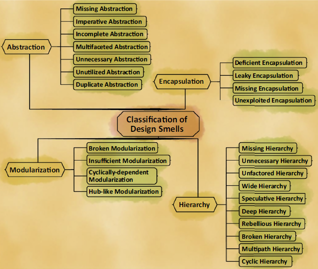

# Girish Suryanarayana et al. Code Smells

[Smell](.) → [Girish Suryanarayana et al. Code Smells](#)

Untuk pembagian materi, kita menggunakan pengelompokan group smell yang telah dibuat oleh Girish Suryanarayana et al. di bukunya.

Semua contoh dalam [repository ini](https://github.com/mrp130/smell/tree/master/src/girish/) dibagi dalam dua package. `before` dan `after`. Sesuai dengan namanya, `before` adalah contoh code yang memiliki code smell yang akan dibahas, `after` adalah hasil setelah di-refactor.

### Penjelasan Smell

- [Abstraction](Abstraction)
- [Encapsulation](Encapsulation)
- [Modularization](Modularization)
- Hirerarchy

## Referensi

- Girish Suryanarayana, Ganesh Samarthyam, Tushar Sharma. Refactoring for Software Design Smells: Managing Technical Debt. Elsevier. 2014
- Ganesh Samarthyam. SOLID Principles & Design Patterns (Via SlideShare) - [https://www.slideshare.net/sgganesh/solid-principles-and-design-patterns](https://www.slideshare.net/sgganesh/solid-principles-and-design-patterns)
